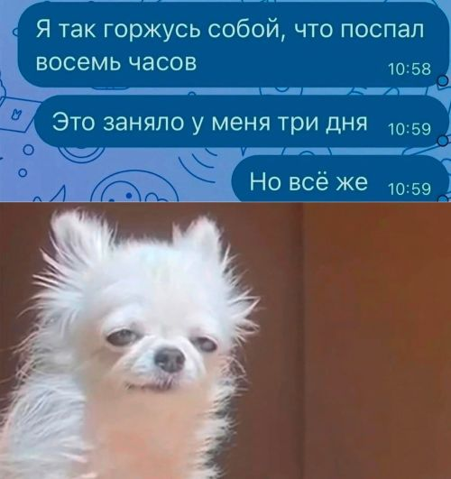
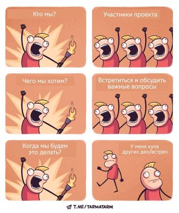
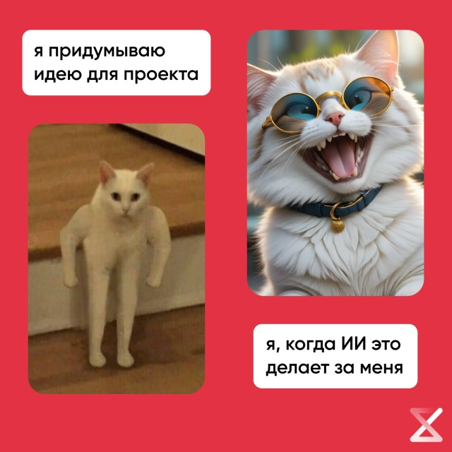

## Дата: 22 марта 2026 года

### Что было сделано
<!-- Опиши, над какими компонентами/фичами работал сегодня. 
     Какие задачи из списка продвинулись? 
     Пример: "Создал компонент Header с кнопками навигации, настроил переключение языка через Observable."
     Пример: "Настроил роутер, добавил страницы Login и API Test."
     Если есть связанные Pull Request'ы или Issue, укажи ссылки: 
     - PR: [#12](https://github.com/Pchyolan/rs-tandem-project/pull/12)
     - Issue: [#5](https://github.com/Pchyolan/rs-tandem-project/issues/5)
-->
Начала рефакторинг дизайна приложения и своего виджета. Сделала первый щаг - единую шапку для всех наших виджетов, однообразную и легко встраиваемую
- Создала компонент WidgetHeader (положила в src/components/widget-header - долго думала куда будет правильнее, так и не поняла). Он теперь умеет показывать:
  - три декоративные точки в стиле macOS (синюю, оранжевую и зелёную) – больше дл красоты, но кто сказал что она не нужна?
  - название виджета, которое динамически подставляется по типу (маппинг в widget-titles.ts);
  - бейдж сложности (Easy/Medium/Hard) с цветовой индикацией: Easy – голубой, Medium – жёлтый, Hard – красный.

- Вынесла цвета точек и бейджа в SCSS-переменные, чтобы можно было менять всё в одном месте.
- Добилась, чтобы бейдж имел фиксированную ширину (70px) и текст центрировался – теперь не прыгает при смене сложности. Не проверила с русским текстом, нужно будет уточнить потом.
- Внедрила WidgetHeader в MemoryGameWidgetCreator, вышло очень даже ничего.
- Написала документацию к компоненту в стиле README, чтобы другие участники команды тоже могли легко подключать шапку к своим виджетам.

Связанные задачи:
- Issue: [#48](https://github.com/Pchyolan/rs-tandem-project/issues/48) (рефакторинг компонента)
- PR: [#51](https://github.com/Pchyolan/rs-tandem-project/pull/51) (уже готов, оставила на проверку Крис)

### Проблемы
<!-- С какими трудностями столкнулся? Опиши ошибки, непонимание, баги. 
     Пример: "Не работал hashchange, пришлось разбираться с инициализацией роутера."
     Пример: "TypeScript ругался на enum из-за опции erasableSyntaxOnly, пришлось заменить на объект."
-->
- Первая версия бейджа имела разную ширину, и при переключении виджетов с разной сложностью интерфейс дёргался. Некрасиво дергаётся при переключении.
- С цветами Medium и Hard: сначала сделала оранжевый и красный, так они сливались на тёмном фоне, их было почти невозможно отличить.
- Пришлось повозиться с тем, чтобы точки были не интерактивными, но при этом правильно встраивались в сетку без лишних отступов.
- Возник архитектурный вопрос: где должна жить шапка – внутри каждого виджета (с дублированием кода) или в билете (TicketPageController)? В первом случае каждый виджет сам отвечает за свою шапку, что проще для независимой разработки, но это приведёт к дублированию кода и сложностям при необходимости изменить Header. Во втором – единый рендеринг шапки в билете, но тогда виджет должен передавать наружу свои данные (название, сложность). Долго взвешивала, какой путь выбрать.

### Решения (или попытки)
<!-- Как пытался решить проблемы? Что помогло или какие варианты пробовал? 
     Пример: "Перечитал документацию по History API, понял, что нужно вызвать start() после добавления маршрутов."
     Пример: "Заменил enum на обычный объект с as const, ошибка исчезла."
-->
- Для фиксированной ширины бейджа добавила min-width: 70px и display: inline-flex с центрированием. Теперь даже если текст "Medium" занимает больше места, остальные бейджи не сжимаются, а текст остаётся по центру.
- Цвета для Medium и Hard пересмотрела: выбрала яркий жёлтый и насыщенный красный. Разница стала очевидной даже при быстром взгляде. Огонь-пожар!
- Для точек использовала SVG-круги, обёрнутые в отдельные `
` с gap, – так проще управлять расстоянием, и они не съезжают при изменении размера экрана. Точки получились как надо прям. Все цвета брала с картинки PNG, научилась пользоваться Photoshop для анализа дизайна.
- Архитектурный выбор: остановилась на заголовке внутри каждого виджета, а не в билете, но не напрямую, а через отдельный компонент, который можно подключать. Аргументы:
    - Виджет сам знает своё название и сложность, не нужно передавать эту информацию наружу.
    - При таком подходе шапка становится частью виджета, но реализована через переиспользуемый компонент WidgetHeader, так что дублирования кода нет.
    - Это оставляет гибкость: если когда-нибудь потребуется уникальный дизайн шапки для конкретного виджета, его легко изменить, не затрагивая билет.
    - В билете остаётся только переключение виджетов и спиннер, что соответствует принципу единственной ответственности.
- В итоге MemoryGameWidgetCreator просто добавляет WidgetHeader в свой append рядом с рендерером – получилось чисто и логично.

### Мысли / Планы
<!-- Какие идеи возникли? Что планируешь делать дальше? 
     Пример: "Подумал, что стоит добавить защиту маршрутов через Observable."
     Пример: "Завтра начну делать страницу API Test с полями для email и пароля."
     Если планируешь создать Issue для задачи, укажи ссылку на него (можно создать заранее):
     - Issue: [#8](https://github.com/Pchyolan/rs-tandem-project/issues/8)
-->
- Очень хочется добавить анимацию для точек (например, чтобы они мигали при загрузке), но пока оставлю это на потом – задача не приоритетная.
- Придумала план как внедрять дизайн дальше, сделала для этого Issue: [#57](https://github.com/Pchyolan/rs-tandem-project/issues/57), Issue: [#58](https://github.com/Pchyolan/rs-tandem-project/issues/58)
- Сгенерировала часть картинок с персонажем - мозгом на прозрачном фоне, теперь они готовы для добавления в приложение. Жаль, на этом закончился лимит))
- Планировала закончить к 23-м, максиму посидеть до 24-х часов. Уже 4 утра, бугагашечка)))

- Закопалась в работе и не заметила, что завис телеграмм, опомнилась только в час ночи - пропустила сегодня встречу. Печалька((

### Затраченное время
<!-- Укажи примерное количество часов, потраченных сегодня на проект. Например: 5 часов -->
Около 6 часов (с перерывами на чай и попытки подобрать идеальный оттенок жёлтого, а также обдумывание архитектурных вариантов).

### Использование AI (если применимо)
<!-- Отметь, использовал ли сегодня AI-инструменты (ChatGPT, Copilot, Kiro) и для каких задач. 
     Например: "Использовал ChatGPT для генерации шаблона PR." или "Copilot помог написать базовую структуру компонента."
     Это важно для прозрачности и оценки личного вклада. -->
- генерация картинок с персонажем
- помощь с подбором цветов, особенно пресловутого жёлтого для сложности Medium
- научила DeepSeek генерировать мне Issue и Pull Request: он теперь знает шаблоны, а я наговариваю ему голосом что нужно сделать, иногда показываю файлы со сделанным - очень быстро и удобно, очень облегчает написание текстов. Кайф)

